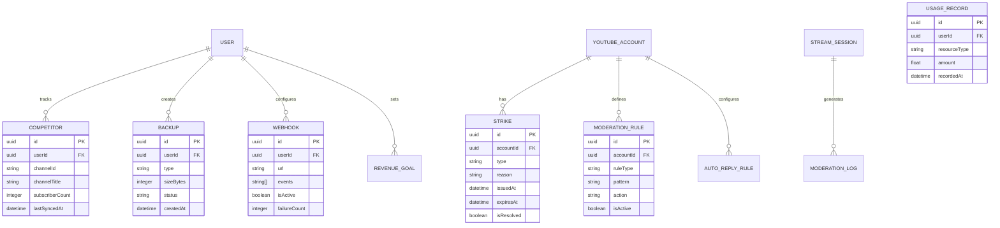

# Design Document: YouTube Live Streaming Automation & Multi-Account Management

## Overview

Aplikasi ini adalah platform SaaS untuk mengelola multiple akun YouTube, mengotomatisasi live streaming, dan memanfaatkan AI untuk optimasi konten. Sistem dibangun dengan arsitektur microservices yang scalable, menggunakan job queue untuk task processing, dan distributed agents untuk streaming automation.

### Key Design Goals
- **Scalability**: Mendukung ribuan concurrent streams dan users
- **Reliability**: 99.9% uptime dengan failover dan retry mechanisms
- **Security**: Enkripsi end-to-end untuk OAuth tokens dan sensitive data
- **Extensibility**: Plugin architecture untuk integrasi platform baru

### Technology Stack
- **Frontend**: Next.js 14 (App Router), TypeScript, TailwindCSS, Shadcn/UI
- **Backend**: Python 3.11+ dengan FastAPI framework
- **ORM**: SQLAlchemy 2.0 dengan async support
- **Database**: PostgreSQL (primary), Redis (cache & queue)
- **Message Queue**: Celery dengan Redis broker
- **Streaming**: FFmpeg untuk transcoding, RTMP server
- **AI**: OpenAI API untuk content optimization, Stable Diffusion untuk thumbnails
- **Storage**: S3-compatible object storage (MinIO/AWS S3)
- **Monitoring**: Prometheus, Grafana, OpenTelemetry
- **Validation**: Pydantic v2 untuk data validation

---

## Architecture

### High-Level Architecture Diagram


### Service Responsibilities

| Service | Responsibility |
|---------|---------------|
| Auth Service | User authentication, JWT management, 2FA, password reset |
| Account Service | YouTube OAuth, token management, channel sync, quota tracking |
| Video Service | Upload, metadata, publishing, thumbnails, bulk operations |
| Stream Service | Live events, scheduling, health monitoring, simulcast, playlist |
| Transcoding Service | FFmpeg encoding, resolution conversion, ABR |
| AI Service | Title/description/tags generation, thumbnail generation, chat response |
| Moderation Service | Chat moderation + Comment management, sentiment analysis, auto-reply |
| Analytics Service | Metrics aggregation, reporting, revenue tracking, AI insights |
| Competitor Service | External channel tracking, comparison, recommendations |
| Strike Service | Strike detection, warnings, risk assessment |
| Monitoring Service | Multi-channel dashboard, real-time status grid |
| Agent Service | Worker registration, heartbeat, job assignment |
| Job Queue Service | Job processing, retry logic, DLQ management |
| Notification Service | Multi-channel alerts (email, SMS, Slack, Telegram, WhatsApp) |
| Billing Service | Usage metering + Subscription management + Payment processing |
| Backup Service | Data backup, export, import, restore |
| Integration Service | API key management + Webhook configuration |

---

## Components and Interfaces

### 1. Authentication Module

```python
from pydantic import BaseModel
from datetime import datetime

class AuthTokens(BaseModel):
    access_token: str
    refresh_token: str
    expires_in: int
    token_type: str = "bearer"

class AuthService:
    async def register(self, data: RegisterDTO) -> User: ...
    async def login(self, credentials: LoginDTO) -> AuthTokens: ...
    async def refresh_token(self, refresh_token: str) -> AuthTokens: ...
    async def enable_2fa(self, user_id: str) -> TwoFactorSetup: ...
    async def verify_2fa(self, user_id: str, code: str) -> bool: ...
    async def reset_password(self, email: str) -> None: ...
    async def validate_token(self, token: str) -> TokenPayload: ...
```

### 2. YouTube Account Module

```python
from pydantic import BaseModel
from typing import Optional
from datetime import datetime

class YouTubeAccountService:
    async def initiate_oauth(self, user_id: str) -> OAuthUrl: ...
    async def handle_callback(self, code: str, state: str) -> YouTubeAccount: ...
    async def refresh_access_token(self, account_id: str) -> None: ...
    async def get_accounts(self, user_id: str) -> list[YouTubeAccount]: ...
    async def get_account_health(self, account_id: str) -> AccountHealth: ...
    async def get_quota_usage(self, account_id: str) -> QuotaUsage: ...
    async def disconnect_account(self, account_id: str) -> None: ...
    async def sync_channel_data(self, account_id: str) -> ChannelData: ...

class YouTubeAccount(BaseModel):
    id: str
    user_id: str
    channel_id: str
    channel_title: str
    thumbnail_url: str
    subscriber_count: int
    video_count: int
    is_monetized: bool
    has_live_streaming_enabled: bool
    strike_count: int
    token_expires_at: datetime
    last_sync_at: datetime
    status: Literal['active', 'expired', 'error']
```

### 3. Video Management Module

```python
from enum import Enum
from typing import Literal

class VideoStatus(str, Enum):
    DRAFT = "draft"
    UPLOADING = "uploading"
    PROCESSING = "processing"
    PUBLISHED = "published"
    SCHEDULED = "scheduled"

class VideoService:
    async def upload_video(self, data: UploadVideoDTO) -> UploadJob: ...
    async def bulk_upload(self, data: BulkUploadDTO) -> list[UploadJob]: ...
    async def get_upload_progress(self, job_id: str) -> UploadProgress: ...
    async def update_metadata(self, video_id: str, data: VideoMetadataDTO) -> Video: ...
    async def bulk_update_metadata(self, data: BulkMetadataDTO) -> BulkResult: ...
    async def schedule_publish(self, video_id: str, publish_at: datetime) -> Video: ...
    async def apply_template(self, video_id: str, template_id: str) -> Video: ...
    async def get_videos(self, account_id: str, filters: VideoFilters) -> PaginatedVideos: ...

class Video(BaseModel):
    id: str
    youtube_id: str
    account_id: str
    title: str
    description: str
    tags: list[str]
    category_id: str
    thumbnail_url: str
    visibility: Literal['public', 'unlisted', 'private']
    scheduled_publish_at: Optional[datetime] = None
    published_at: Optional[datetime] = None
    view_count: int
    like_count: int
    comment_count: int
    status: VideoStatus
```

### 4. Live Streaming Module

```python
class StreamService:
    async def create_live_event(self, data: CreateLiveEventDTO) -> LiveEvent: ...
    async def schedule_live_event(self, data: ScheduleLiveEventDTO) -> LiveEvent: ...
    async def start_stream(self, event_id: str) -> StreamSession: ...
    async def stop_stream(self, event_id: str) -> None: ...
    async def get_stream_health(self, session_id: str) -> StreamHealth: ...
    async def update_stream_metadata(self, event_id: str, data: StreamMetadataDTO) -> LiveEvent: ...
    async def create_playlist_stream(self, data: PlaylistStreamDTO) -> LiveEvent: ...
    async def configure_simulcast(self, event_id: str, platforms: list[SimulcastConfig]) -> None: ...

class LiveEvent(BaseModel):
    id: str
    account_id: str
    youtube_broadcast_id: str
    youtube_stream_id: str
    rtmp_key: str  # encrypted
    title: str
    description: str
    thumbnail_url: str
    scheduled_start_at: Optional[datetime] = None
    scheduled_end_at: Optional[datetime] = None
    actual_start_at: Optional[datetime] = None
    actual_end_at: Optional[datetime] = None
    latency_mode: Literal['normal', 'low', 'ultraLow']
    enable_dvr: bool
    is_recurring: bool
    recurrence_pattern: Optional[RecurrencePattern] = None
    status: Literal['created', 'scheduled', 'live', 'ended', 'failed']

class StreamHealth(BaseModel):
    session_id: str
    bitrate: int
    frame_rate: float
    dropped_frames: int
    connection_status: Literal['excellent', 'good', 'fair', 'poor']
    viewer_count: int
    chat_rate: float
    uptime: int
    last_updated_at: datetime
```


### 5. AI Services Module

```python
class AIService:
    async def generate_titles(self, data: TitleGenerationDTO) -> list[TitleSuggestion]: ...
    async def generate_description(self, data: DescriptionGenerationDTO) -> DescriptionSuggestion: ...
    async def suggest_tags(self, data: TagSuggestionDTO) -> list[TagSuggestion]: ...
    async def generate_thumbnail(self, data: ThumbnailGenerationDTO) -> list[ThumbnailResult]: ...
    async def analyze_sentiment(self, comments: list[str]) -> list[SentimentResult]: ...
    async def generate_chat_response(self, data: ChatContextDTO) -> ChatResponse: ...

class TitleSuggestion(BaseModel):
    title: str
    confidence_score: float
    reasoning: str
    keywords: list[str]

class ThumbnailResult(BaseModel):
    id: str
    image_url: str
    style: str
    elements: list[ThumbnailElement]
```

### 6. Job Queue Module (Celery)

```python
from celery import Celery
from enum import Enum

class JobType(str, Enum):
    VIDEO_UPLOAD = "video_upload"
    VIDEO_TRANSCODE = "video_transcode"
    STREAM_START = "stream_start"
    STREAM_STOP = "stream_stop"
    AI_TITLE_GENERATION = "ai_title_generation"
    AI_THUMBNAIL_GENERATION = "ai_thumbnail_generation"
    ANALYTICS_SYNC = "analytics_sync"
    NOTIFICATION_SEND = "notification_send"

class JobQueueService:
    async def enqueue(self, job: JobDefinition) -> Job: ...
    async def get_job_status(self, job_id: str) -> JobStatus: ...
    async def retry_job(self, job_id: str) -> Job: ...
    async def cancel_job(self, job_id: str) -> None: ...
    async def get_queue_stats(self) -> QueueStats: ...
    async def get_dlq_jobs(self) -> list[Job]: ...
    async def reprocess_dlq(self, job_id: str) -> Job: ...

class Job(BaseModel):
    id: str
    type: JobType
    payload: dict
    priority: int
    attempts: int
    max_attempts: int
    status: Literal['queued', 'processing', 'completed', 'failed', 'dlq']
    result: Optional[dict] = None
    error: Optional[str] = None
    created_at: datetime
    started_at: Optional[datetime] = None
    completed_at: Optional[datetime] = None
```

### 7. Agent Management Module

```python
class AgentService:
    async def register_agent(self, data: AgentRegistrationDTO) -> Agent: ...
    async def heartbeat(self, agent_id: str, metrics: AgentMetrics) -> None: ...
    async def assign_job(self, agent_id: str, job: Job) -> None: ...
    async def get_healthy_agents(self, agent_type: AgentType) -> list[Agent]: ...
    async def mark_unhealthy(self, agent_id: str) -> None: ...
    async def reassign_jobs(self, agent_id: str) -> None: ...

class Agent(BaseModel):
    id: str
    type: Literal['ffmpeg', 'rtmp', 'headless']
    hostname: str
    ip_address: str
    status: Literal['healthy', 'unhealthy', 'offline']
    current_load: int
    max_capacity: int
    last_heartbeat: datetime
    assigned_jobs: list[str]
```

---

## Data Models

### Entity Relationship Diagram


---

## Correctness Properties

*A property is a characteristic or behavior that should hold true across all valid executions of a system-essentially, a formal statement about what the system should do. Properties serve as the bridge between human-readable specifications and machine-verifiable correctness guarantees.*

### Property 1: Authentication Token Validity
*For any* valid user credentials, authenticating SHALL produce a valid JWT token that can be decoded and contains the correct user ID and expiration time.
**Validates: Requirements 1.1**

### Property 2: 2FA Enforcement
*For any* user with 2FA enabled, login attempts without valid TOTP code SHALL be rejected, and login attempts with valid TOTP code SHALL succeed.
**Validates: Requirements 1.2**

### Property 3: Audit Trail Completeness
*For any* sensitive action performed by a user, an audit log entry SHALL be created containing user ID, action type, timestamp, and action details.
**Validates: Requirements 1.3**

### Property 4: Password Policy Enforcement
*For any* password that does not meet policy requirements (length, complexity), registration SHALL be rejected with specific violation messages.
**Validates: Requirements 1.4**

### Property 5: OAuth Token Encryption
*For any* stored OAuth refresh token, the token SHALL be encrypted and never stored in plaintext in the database.
**Validates: Requirements 2.2, 25.1**

### Property 6: Token Expiry Alerting
*For any* YouTube account with token expiring within 24 hours, the system SHALL generate an alert notification to the user.
**Validates: Requirements 2.3**

### Property 7: Upload Retry Logic
*For any* failed upload job, the system SHALL retry with exponential backoff up to 3 times before marking as permanently failed.
**Validates: Requirements 3.3**

### Property 8: Bulk Upload Job Creation
*For any* valid CSV file with N video entries, the system SHALL create exactly N individual upload jobs.
**Validates: Requirements 3.5**

### Property 9: Metadata Version History
*For any* video metadata save operation, a new version entry SHALL be created in the version history.
**Validates: Requirements 4.5**

### Property 10: Schedule Conflict Detection
*For any* two live events on the same account with overlapping time ranges, the system SHALL reject the second event and alert the user.
**Validates: Requirements 6.4**

### Property 11: Stream Start Timing
*For any* scheduled live event, the stream SHALL be initiated within 30 seconds of the scheduled start time.
**Validates: Requirements 6.1**

### Property 12: Playlist Loop Behavior
*For any* playlist stream configured with loop count N, the playlist SHALL play exactly N times before stopping (or infinitely if configured).
**Validates: Requirements 7.2**

### Property 13: Stream Health Collection Frequency
*For any* active stream session, health metrics SHALL be collected at intervals not exceeding 10 seconds.
**Validates: Requirements 8.1**

### Property 14: Reconnection Attempt Limit
*For any* unexpected stream disconnection, the system SHALL attempt reconnection exactly up to 5 times before triggering failover.
**Validates: Requirements 8.3, 8.4**

### Property 15: Simulcast Fault Isolation
*For any* simulcast stream where one platform fails, streams to other platforms SHALL continue uninterrupted.
**Validates: Requirements 9.3**

### Property 16: Transcoding Resolution Accuracy
*For any* video transcoded to a specific resolution, the output video SHALL have dimensions matching the configured resolution.
**Validates: Requirements 10.1**

### Property 17: Chatbot Response Timing
*For any* chat message matching configured triggers, the AI chatbot SHALL respond within 3 seconds.
**Validates: Requirements 11.1**

### Property 18: Chat Moderation Timing
*For any* incoming chat message, moderation analysis SHALL complete within 2 seconds.
**Validates: Requirements 12.1**

### Property 19: Moderation Rule Enforcement
*For any* chat message violating moderation rules, the message SHALL be hidden and the action SHALL be logged.
**Validates: Requirements 12.2, 12.5**

### Property 20: Title Generation Count
*For any* title generation request, the system SHALL return exactly 5 title variations with confidence scores.
**Validates: Requirements 14.1, 14.4**

### Property 21: Thumbnail Generation Count
*For any* thumbnail generation request, the system SHALL return exactly 3 thumbnail variations.
**Validates: Requirements 15.1**

### Property 22: Thumbnail Dimension Compliance
*For any* generated or optimized thumbnail, the output dimensions SHALL be exactly 1280x720 pixels.
**Validates: Requirements 15.3**

### Property 23: Channel Filter Accuracy
*For any* channel filter applied in monitoring view, the returned channels SHALL match the filter criteria exactly.
**Validates: Requirements 16.2**

### Property 24: Analytics Date Range Accuracy
*For any* analytics query with date range, all returned metrics SHALL fall within the specified date range.
**Validates: Requirements 17.2**

### Property 25: Revenue Source Breakdown
*For any* revenue calculation, the sum of individual source amounts SHALL equal the total revenue amount.
**Validates: Requirements 18.2**

### Property 26: Strike Status Sync
*For any* connected YouTube account, the strike status displayed SHALL match the actual YouTube account strike status.
**Validates: Requirements 20.1**

### Property 27: Agent Health Detection
*For any* agent that misses heartbeat for 60 seconds, the agent status SHALL be marked as unhealthy.
**Validates: Requirements 21.2**

### Property 28: Job Load Balancing
*For any* job dispatch to agents, the job SHALL be assigned to the healthy agent with the lowest current load.
**Validates: Requirements 21.3**

### Property 29: Job Retry Exponential Backoff
*For any* failed job retry, the delay between retries SHALL follow exponential backoff pattern.
**Validates: Requirements 22.2**

### Property 30: DLQ Alert Generation
*For any* job moved to Dead Letter Queue, an alert SHALL be generated to operators.
**Validates: Requirements 22.3**

### Property 31: Notification Delivery Timing
*For any* configured event, notification SHALL be delivered within 60 seconds of event occurrence.
**Validates: Requirements 23.1**

### Property 32: Usage Warning Thresholds
*For any* usage approaching plan limit, warnings SHALL be sent at 50%, 75%, and 90% thresholds.
**Validates: Requirements 27.2**

### Property 33: Plan Feature Provisioning
*For any* subscription plan selection, the user SHALL have access to exactly the features defined for that tier.
**Validates: Requirements 28.1**

### Property 34: API Rate Limiting
*For any* API key, requests exceeding the rate limit SHALL be rejected with appropriate error response.
**Validates: Requirements 29.2**

### Property 35: Webhook Retry Logic
*For any* failed webhook delivery, the system SHALL retry with exponential backoff up to 5 times.
**Validates: Requirements 29.4**

---

## Error Handling

### Error Categories

| Category | HTTP Status | Handling Strategy |
|----------|-------------|-------------------|
| Validation Error | 400 | Return specific field errors |
| Authentication Error | 401 | Clear tokens, redirect to login |
| Authorization Error | 403 | Log attempt, return forbidden |
| Not Found | 404 | Return resource not found |
| Rate Limit | 429 | Return retry-after header |
| YouTube API Error | 502 | Retry with backoff, alert if persistent |
| Internal Error | 500 | Log with correlation ID, return generic message |

### Retry Strategies

```python
from dataclasses import dataclass

@dataclass
class RetryConfig:
    max_attempts: int
    initial_delay: float  # seconds
    max_delay: float
    backoff_multiplier: float

RETRY_CONFIGS = {
    "youtube_api": RetryConfig(max_attempts=3, initial_delay=1.0, max_delay=30.0, backoff_multiplier=2),
    "upload": RetryConfig(max_attempts=3, initial_delay=5.0, max_delay=60.0, backoff_multiplier=2),
    "stream_reconnect": RetryConfig(max_attempts=5, initial_delay=2.0, max_delay=30.0, backoff_multiplier=1.5),
    "webhook": RetryConfig(max_attempts=5, initial_delay=1.0, max_delay=300.0, backoff_multiplier=2),
}
```

### Circuit Breaker Pattern

```python
from dataclasses import dataclass

@dataclass
class CircuitBreakerConfig:
    failure_threshold: int
    reset_timeout: float  # seconds
    half_open_requests: int

# Applied to external service calls (YouTube API, AI services, payment gateway)
```


---

## Testing Strategy

### Dual Testing Approach

This project uses both unit testing and property-based testing to ensure comprehensive coverage:

- **Unit Tests**: Verify specific examples, edge cases, and integration points
- **Property-Based Tests**: Verify universal properties that should hold across all inputs

### Testing Framework

- **Unit Testing**: pytest with pytest-asyncio
- **Property-Based Testing**: Hypothesis library
- **Integration Testing**: pytest with httpx for API endpoints
- **E2E Testing**: Playwright for UI flows

### Property-Based Testing Configuration

```python
from hypothesis import settings, Verbosity

# Configure minimum 100 iterations per property test
settings.register_profile("ci", max_examples=100)
settings.register_profile("dev", max_examples=50)
settings.load_profile("ci")
```

### Test Organization

```
backend/
├── app/
│   ├── modules/
│   │   ├── auth/
│   │   │   ├── service.py
│   │   │   ├── test_service.py           # Unit tests
│   │   │   └── test_service_property.py  # Property tests
│   │   ├── video/
│   │   │   ├── service.py
│   │   │   ├── test_service.py
│   │   │   └── test_service_property.py
│   │   └── ...
└── tests/
    ├── integration/
    └── e2e/
```

### Property Test Examples

```python
from hypothesis import given, strategies as st, settings
import pytest

# Example: Property 7 - Upload Retry Logic
class TestUploadRetryLogic:
    @given(failure_count=st.integers(min_value=1, max_value=10))
    @settings(max_examples=100)
    def test_upload_retry_logic(self, failure_count: int):
        """**Feature: youtube-automation, Property 7: Upload Retry Logic**"""
        result = simulate_upload_with_failures(failure_count)
        if failure_count <= 3:
            assert result.status == "completed"
            assert result.attempts <= 3
        else:
            assert result.status == "failed"
            assert result.attempts == 3

# Example: Property 10 - Schedule Conflict Detection
class TestScheduleConflictDetection:
    @given(
        start_time=st.datetimes(),
        duration=st.integers(min_value=1, max_value=240),
        overlap_offset=st.integers(min_value=-60, max_value=60)
    )
    @settings(max_examples=100)
    def test_schedule_conflict_detection(self, start_time, duration, overlap_offset):
        """**Feature: youtube-automation, Property 10: Schedule Conflict Detection**"""
        event1 = create_event(start_time, duration)
        event2_start = start_time + timedelta(minutes=overlap_offset)
        event2 = create_event(event2_start, duration)
        
        has_overlap = check_overlap(event1, event2)
        result = schedule_event(event1.account_id, event2)
        
        if has_overlap:
            assert result.success is False
            assert "conflict" in result.error
```

### Unit Test Coverage Requirements

| Module | Minimum Coverage |
|--------|-----------------|
| Auth | 90% |
| Video | 85% |
| Stream | 85% |
| AI | 80% |
| Billing | 90% |
| Job Queue | 85% |

### Integration Test Scenarios

1. **OAuth Flow**: Complete YouTube account connection flow
2. **Upload Pipeline**: File upload → transcoding → YouTube upload
3. **Stream Lifecycle**: Create → Schedule → Start → Monitor → Stop
4. **Billing Flow**: Plan selection → Payment → Feature provisioning

---

## Security Considerations

### Data Encryption

| Data Type | At Rest | In Transit |
|-----------|---------|------------|
| OAuth Tokens | AES-256 (KMS) | TLS 1.3 |
| RTMP Keys | AES-256 (KMS) | TLS 1.3 |
| User Passwords | bcrypt (cost 12) | TLS 1.3 |
| API Keys | SHA-256 hash | TLS 1.3 |
| PII | AES-256 | TLS 1.3 |

### Authentication Security

- JWT tokens with 15-minute expiry
- Refresh tokens with 7-day expiry and rotation
- TOTP-based 2FA with backup codes
- Rate limiting on auth endpoints (5 attempts/minute)

### API Security

- API key scoping with granular permissions
- Request signing for webhooks
- IP allowlisting option for enterprise
- CORS configuration per environment

---

## Deployment Architecture


### Scaling Strategy

| Component | Scaling Trigger | Max Instances |
|-----------|----------------|---------------|
| API Servers | CPU > 70% | 10 |
| Workers | Queue depth > 100 | 20 |
| FFmpeg Agents | Active transcodes > 5/agent | 50 |
| RTMP Agents | Active streams > 3/agent | 100 |


---

## Additional Components (Missing from Initial Design)

### 8. Chat Moderation Module

```python
class ChatModerationService:
    async def analyze_message(self, message: ChatMessage) -> ModerationResult: ...
    async def apply_action(self, message_id: str, action: ModerationAction) -> None: ...
    async def get_moderation_rules(self, account_id: str) -> list[ModerationRule]: ...
    async def create_rule(self, data: CreateRuleDTO) -> ModerationRule: ...
    async def update_rule(self, rule_id: str, data: UpdateRuleDTO) -> ModerationRule: ...
    async def delete_rule(self, rule_id: str) -> None: ...
    async def get_moderation_logs(self, filters: ModerationLogFilters) -> list[ModerationLog]: ...
    async def configure_slow_mode(self, stream_id: str, config: SlowModeConfig) -> None: ...
    async def register_custom_command(self, data: CustomCommandDTO) -> CustomCommand: ...

class ModerationRule(BaseModel):
    id: str
    account_id: str
    rule_type: Literal['keyword', 'regex', 'spam', 'caps', 'links']
    pattern: str
    action: Literal['hide', 'delete', 'timeout', 'ban']
    timeout_duration: Optional[int] = None  # seconds
    is_active: bool
    created_at: datetime

class ModerationLog(BaseModel):
    id: str
    stream_id: str
    message_id: str
    user_id: str
    username: str
    original_message: str
    rule_id: str
    action_taken: str
    timestamp: datetime
```

### 9. Comment Management Module

```python
class CommentService:
    async def get_comments(self, filters: CommentFilters) -> PaginatedComments: ...
    async def get_unified_inbox(self, user_id: str) -> list[Comment]: ...
    async def reply_to_comment(self, comment_id: str, reply: str) -> Comment: ...
    async def bulk_moderate(self, comment_ids: list[str], action: str) -> BulkResult: ...
    async def analyze_sentiment(self, comment_ids: list[str]) -> list[SentimentResult]: ...
    async def get_auto_reply_rules(self, account_id: str) -> list[AutoReplyRule]: ...
    async def create_auto_reply_rule(self, data: AutoReplyRuleDTO) -> AutoReplyRule: ...
    async def sync_comments(self, account_id: str) -> SyncResult: ...

class Comment(BaseModel):
    id: str
    youtube_id: str
    account_id: str
    video_id: str
    author_name: str
    author_channel_id: str
    text: str
    like_count: int
    reply_count: int
    sentiment: Optional[Literal['positive', 'neutral', 'negative']] = None
    requires_attention: bool
    is_replied: bool
    published_at: datetime
    synced_at: datetime

class AutoReplyRule(BaseModel):
    id: str
    account_id: str
    trigger_type: Literal['keyword', 'regex', 'question']
    trigger_pattern: str
    reply_template: str
    is_active: bool
```

### 10. Analytics & Reporting Module

```python
class AnalyticsService:
    async def get_dashboard_metrics(self, user_id: str) -> DashboardMetrics: ...
    async def get_channel_analytics(self, account_id: str, date_range: DateRange) -> ChannelAnalytics: ...
    async def get_video_analytics(self, video_id: str, date_range: DateRange) -> VideoAnalytics: ...
    async def get_stream_analytics(self, stream_id: str) -> StreamAnalytics: ...
    async def compare_channels(self, account_ids: list[str], date_range: DateRange) -> ComparisonResult: ...
    async def generate_report(self, config: ReportConfig) -> Report: ...
    async def export_report(self, report_id: str, format: Literal['pdf', 'csv']) -> bytes: ...
    async def get_ai_insights(self, account_id: str) -> list[AIInsight]: ...

class DashboardMetrics(BaseModel):
    total_subscribers: int
    total_views: int
    total_watch_time: int  # minutes
    total_revenue: float
    active_streams: int
    scheduled_streams: int
    subscriber_change: int
    view_change_percent: float
    top_performing_videos: list[VideoSummary]
    recent_activity: list[ActivityItem]

class ChannelAnalytics(BaseModel):
    account_id: str
    date_range: DateRange
    views: int
    watch_time: int
    subscribers_gained: int
    subscribers_lost: int
    estimated_revenue: float
    top_videos: list[VideoAnalytics]
    traffic_sources: dict[str, int]
    demographics: Demographics
    daily_metrics: list[DailyMetric]
```

### 11. Revenue & Monetization Module

```python
class RevenueService:
    async def get_revenue_dashboard(self, user_id: str) -> RevenueDashboard: ...
    async def get_revenue_breakdown(self, account_id: str, date_range: DateRange) -> RevenueBreakdown: ...
    async def set_revenue_goal(self, data: RevenueGoalDTO) -> RevenueGoal: ...
    async def get_goal_progress(self, goal_id: str) -> GoalProgress: ...
    async def forecast_revenue(self, account_id: str, months: int) -> RevenueForecast: ...
    async def generate_tax_report(self, user_id: str, year: int) -> TaxReport: ...
    async def sync_revenue_data(self, account_id: str) -> SyncResult: ...

class RevenueDashboard(BaseModel):
    total_revenue: float
    revenue_by_account: dict[str, float]
    revenue_by_source: RevenueBySource
    monthly_trend: list[MonthlyRevenue]
    active_goals: list[RevenueGoal]

class RevenueBySource(BaseModel):
    ads: float
    memberships: float
    super_chats: float
    super_stickers: float
    merchandise: float
    other: float

class RevenueGoal(BaseModel):
    id: str
    user_id: str
    target_amount: float
    current_amount: float
    start_date: date
    end_date: date
    progress_percent: float
    forecast_achievement: float  # probability 0-1
```

### 12. Competitor Analysis Module

```python
class CompetitorService:
    async def add_competitor(self, data: AddCompetitorDTO) -> Competitor: ...
    async def remove_competitor(self, competitor_id: str) -> None: ...
    async def get_competitors(self, user_id: str) -> list[Competitor]: ...
    async def get_competitor_metrics(self, competitor_id: str) -> CompetitorMetrics: ...
    async def compare_with_competitors(self, account_id: str) -> ComparisonResult: ...
    async def get_ai_recommendations(self, account_id: str) -> list[Recommendation]: ...
    async def track_new_content(self, competitor_id: str) -> list[NewContent]: ...
    async def export_analysis(self, competitor_ids: list[str]) -> bytes: ...

class Competitor(BaseModel):
    id: str
    user_id: str
    channel_id: str
    channel_title: str
    thumbnail_url: str
    subscriber_count: int
    video_count: int
    total_views: int
    avg_views_per_video: int
    upload_frequency: float  # videos per week
    last_synced_at: datetime

class CompetitorMetrics(BaseModel):
    competitor_id: str
    subscriber_growth: list[DataPoint]
    view_growth: list[DataPoint]
    engagement_rate: float
    top_videos: list[VideoSummary]
    content_categories: dict[str, int]
    posting_schedule: dict[str, int]  # day of week -> count
```

### 13. Strike Detection Module

```python
class StrikeService:
    async def get_strike_status(self, account_id: str) -> StrikeStatus: ...
    async def get_strike_history(self, account_id: str) -> list[Strike]: ...
    async def check_content_risk(self, video_id: str) -> RiskAssessment: ...
    async def pause_scheduled_streams(self, account_id: str) -> int: ...
    async def resume_scheduled_streams(self, account_id: str) -> int: ...
    async def sync_strike_data(self, account_id: str) -> SyncResult: ...
    async def get_appeal_status(self, strike_id: str) -> AppealStatus: ...

class StrikeStatus(BaseModel):
    account_id: str
    active_strikes: int
    strike_expiry_dates: list[date]
    is_at_risk: bool
    restrictions: list[str]
    last_checked_at: datetime

class Strike(BaseModel):
    id: str
    account_id: str
    type: Literal['copyright', 'community_guidelines', 'terms_of_service']
    reason: str
    video_id: Optional[str]
    issued_at: datetime
    expires_at: datetime
    appeal_status: Optional[Literal['pending', 'approved', 'rejected']]
    is_resolved: bool
```

### 14. Backup & Data Export Module

```python
class BackupService:
    async def create_backup(self, user_id: str) -> Backup: ...
    async def schedule_backup(self, data: ScheduleBackupDTO) -> BackupSchedule: ...
    async def get_backups(self, user_id: str) -> list[Backup]: ...
    async def download_backup(self, backup_id: str) -> bytes: ...
    async def restore_backup(self, backup_id: str, options: RestoreOptions) -> RestoreResult: ...
    async def export_data(self, user_id: str, format: Literal['json', 'csv']) -> bytes: ...
    async def import_data(self, user_id: str, data: bytes) -> ImportResult: ...
    async def delete_backup(self, backup_id: str) -> None: ...

class Backup(BaseModel):
    id: str
    user_id: str
    type: Literal['manual', 'scheduled']
    size_bytes: int
    includes: list[str]  # ['accounts', 'videos', 'streams', 'analytics', 'settings']
    created_at: datetime
    expires_at: Optional[datetime]
    download_url: Optional[str]
    status: Literal['creating', 'ready', 'expired', 'failed']

class BackupSchedule(BaseModel):
    id: str
    user_id: str
    frequency: Literal['daily', 'weekly', 'monthly']
    retention_count: int
    next_run_at: datetime
    is_active: bool
```

### 15. Usage Metering Module

```python
class UsageService:
    async def get_usage_dashboard(self, user_id: str) -> UsageDashboard: ...
    async def get_usage_breakdown(self, user_id: str, date_range: DateRange) -> UsageBreakdown: ...
    async def check_quota(self, user_id: str, resource: str) -> QuotaStatus: ...
    async def track_usage(self, event: UsageEvent) -> None: ...
    async def get_usage_history(self, user_id: str, resource: str) -> list[UsageRecord]: ...
    async def export_usage(self, user_id: str, date_range: DateRange) -> bytes: ...

class UsageDashboard(BaseModel):
    user_id: str
    plan_id: str
    billing_period_start: date
    billing_period_end: date
    api_calls: UsageMetric
    encoding_minutes: UsageMetric
    storage_gb: UsageMetric
    bandwidth_gb: UsageMetric
    connected_accounts: UsageMetric
    concurrent_streams: UsageMetric

class UsageMetric(BaseModel):
    used: float
    limit: float
    percent: float
    warning_threshold_reached: bool
    overage: float
```

### 16. API & Webhook Module

```python
class APIKeyService:
    async def create_api_key(self, data: CreateAPIKeyDTO) -> APIKey: ...
    async def get_api_keys(self, user_id: str) -> list[APIKey]: ...
    async def revoke_api_key(self, key_id: str) -> None: ...
    async def validate_api_key(self, key: str) -> APIKeyValidation: ...
    async def get_api_usage(self, key_id: str) -> APIUsage: ...

class WebhookService:
    async def create_webhook(self, data: CreateWebhookDTO) -> Webhook: ...
    async def get_webhooks(self, user_id: str) -> list[Webhook]: ...
    async def update_webhook(self, webhook_id: str, data: UpdateWebhookDTO) -> Webhook: ...
    async def delete_webhook(self, webhook_id: str) -> None: ...
    async def test_webhook(self, webhook_id: str) -> WebhookTestResult: ...
    async def get_delivery_logs(self, webhook_id: str) -> list[WebhookDelivery]: ...
    async def retry_delivery(self, delivery_id: str) -> WebhookDelivery: ...

class APIKey(BaseModel):
    id: str
    user_id: str
    name: str
    key_prefix: str  # first 8 chars for identification
    scopes: list[str]
    rate_limit: int  # requests per minute
    last_used_at: Optional[datetime]
    expires_at: Optional[datetime]
    is_active: bool
    created_at: datetime

class Webhook(BaseModel):
    id: str
    user_id: str
    url: str
    events: list[str]  # ['stream.started', 'video.uploaded', etc.]
    secret: str  # for signature verification
    is_active: bool
    failure_count: int
    last_triggered_at: Optional[datetime]
    created_at: datetime

class WebhookDelivery(BaseModel):
    id: str
    webhook_id: str
    event_type: str
    payload: dict
    response_status: Optional[int]
    response_body: Optional[str]
    attempts: int
    status: Literal['pending', 'delivered', 'failed']
    created_at: datetime
    delivered_at: Optional[datetime]
```

### 17. Monitoring Dashboard Module

```python
class MonitoringService:
    async def get_channel_grid(self, user_id: str, filters: ChannelFilters) -> list[ChannelTile]: ...
    async def get_channel_details(self, account_id: str) -> ChannelDetails: ...
    async def save_layout_preferences(self, user_id: str, prefs: LayoutPreferences) -> None: ...
    async def get_layout_preferences(self, user_id: str) -> LayoutPreferences: ...
    async def get_critical_alerts(self, user_id: str) -> list[CriticalAlert]: ...

class ChannelTile(BaseModel):
    account_id: str
    channel_title: str
    thumbnail_url: str
    status: Literal['live', 'scheduled', 'offline', 'error', 'token_expired']
    current_viewers: Optional[int]
    stream_health: Optional[Literal['excellent', 'good', 'fair', 'poor']]
    next_scheduled: Optional[datetime]
    has_critical_issue: bool
    strike_count: int
    last_activity: datetime

class ChannelFilters(BaseModel):
    status: Optional[list[str]] = None
    has_issues: Optional[bool] = None
    search: Optional[str] = None
    sort_by: Literal['name', 'status', 'viewers', 'last_activity'] = 'name'
    sort_order: Literal['asc', 'desc'] = 'asc'

class LayoutPreferences(BaseModel):
    grid_columns: int
    tile_size: Literal['small', 'medium', 'large']
    show_metrics: list[str]
    default_filters: ChannelFilters
```

---

## Updated Data Models

### Additional Entities




---

## Frontend Design

### UI/UX Design Principles

1. **Modern & Clean**: Minimalist design with ample whitespace
2. **Dark/Light Mode**: Full theme support with system preference detection
3. **Responsive**: Mobile-first approach, works on all screen sizes
4. **Animated**: Smooth transitions and micro-interactions with Framer Motion
5. **Accessible**: WCAG 2.1 AA compliant

### Technology Stack (Frontend)

- **Framework**: Next.js 14 with App Router
- **Language**: TypeScript
- **Styling**: TailwindCSS with custom design tokens
- **Components**: Shadcn/UI (Radix UI primitives)
- **Animations**: Framer Motion
- **Charts**: Recharts
- **Forms**: React Hook Form + Zod validation
- **State**: Zustand for global state, React Query for server state
- **Icons**: Lucide Icons

### Design System

```typescript
// Color Palette
const colors = {
  primary: {
    50: '#eff6ff',
    500: '#3b82f6',
    600: '#2563eb',
    700: '#1d4ed8',
  },
  success: '#22c55e',
  warning: '#f59e0b',
  error: '#ef4444',
  neutral: {
    50: '#fafafa',
    100: '#f4f4f5',
    200: '#e4e4e7',
    800: '#27272a',
    900: '#18181b',
  }
};

// Typography
const typography = {
  fontFamily: 'Inter, system-ui, sans-serif',
  heading: {
    h1: '2.25rem / 700',
    h2: '1.875rem / 600',
    h3: '1.5rem / 600',
  },
  body: {
    large: '1.125rem / 400',
    base: '1rem / 400',
    small: '0.875rem / 400',
  }
};

// Spacing
const spacing = {
  xs: '0.25rem',
  sm: '0.5rem',
  md: '1rem',
  lg: '1.5rem',
  xl: '2rem',
  '2xl': '3rem',
};

// Border Radius
const borderRadius = {
  sm: '0.25rem',
  md: '0.5rem',
  lg: '0.75rem',
  xl: '1rem',
  full: '9999px',
};
```

### Page Layouts

```
┌─────────────────────────────────────────────────────────────┐
│  Header (Logo, Search, Notifications, User Menu)            │
├──────────┬──────────────────────────────────────────────────┤
│          │                                                  │
│  Sidebar │              Main Content Area                   │
│  (Nav)   │                                                  │
│          │  ┌────────────────────────────────────────────┐  │
│  - Home  │  │  Page Header (Title, Actions)              │  │
│  - Videos│  ├────────────────────────────────────────────┤  │
│  - Live  │  │                                            │  │
│  - Chat  │  │  Content                                   │  │
│  - Stats │  │                                            │  │
│  - ...   │  │                                            │  │
│          │  │                                            │  │
│          │  └────────────────────────────────────────────┘  │
│          │                                                  │
└──────────┴──────────────────────────────────────────────────┘
```

### Key UI Components

#### 1. Dashboard Cards
```
┌─────────────────────────┐
│  📊 Total Subscribers   │
│  ━━━━━━━━━━━━━━━━━━━━━  │
│  1,234,567              │
│  ↑ 12.5% vs last month  │
└─────────────────────────┘
```

#### 2. Channel Tile (Monitoring Grid)
```
┌─────────────────────────┐
│  [Thumbnail]            │
│  Channel Name           │
│  ● LIVE  👁 1.2K        │
│  ████████░░ 85% health  │
└─────────────────────────┘
```

#### 3. Stream Control Panel
```
┌─────────────────────────────────────────────┐
│  [Live Preview]                             │
│                                             │
│  ┌─────────┐ ┌─────────┐ ┌─────────┐       │
│  │  START  │ │  STOP   │ │ RESTART │       │
│  └─────────┘ └─────────┘ └─────────┘       │
│                                             │
│  Viewers: 1,234  │  Health: Excellent       │
│  Duration: 01:23:45  │  Bitrate: 6000 kbps  │
└─────────────────────────────────────────────┘
```

#### 4. Video Upload Zone
```
┌─────────────────────────────────────────────┐
│                                             │
│     ┌───────────────────────────────┐       │
│     │                               │       │
│     │    📁 Drag & Drop Files       │       │
│     │    or click to browse         │       │
│     │                               │       │
│     └───────────────────────────────┘       │
│                                             │
│  Supported: MP4, MOV, AVI (max 128GB)       │
└─────────────────────────────────────────────┘
```

### Animation Guidelines

```typescript
// Page transitions
const pageTransition = {
  initial: { opacity: 0, y: 20 },
  animate: { opacity: 1, y: 0 },
  exit: { opacity: 0, y: -20 },
  transition: { duration: 0.3, ease: 'easeOut' }
};

// Card hover
const cardHover = {
  scale: 1.02,
  boxShadow: '0 10px 40px rgba(0,0,0,0.1)',
  transition: { duration: 0.2 }
};

// Button press
const buttonTap = {
  scale: 0.98,
  transition: { duration: 0.1 }
};

// Skeleton loading
const skeletonPulse = {
  opacity: [0.5, 1, 0.5],
  transition: { duration: 1.5, repeat: Infinity }
};
```

### Responsive Breakpoints

| Breakpoint | Width | Layout |
|------------|-------|--------|
| Mobile | < 640px | Single column, bottom nav |
| Tablet | 640px - 1024px | Collapsible sidebar |
| Desktop | > 1024px | Full sidebar, multi-column |

### Accessibility Features

- Keyboard navigation support
- Screen reader labels (aria-label)
- Focus indicators
- Color contrast ratio > 4.5:1
- Reduced motion support
- Skip to content link
